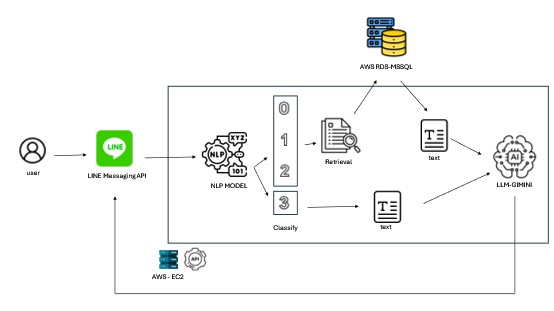

# 專案名稱：LINE Messaging API：台北捷運AI問答系統
## 專案簡介
說明：此系統開發為方便搭車台北捷運的乘客能更加快速得知捷運狀況
目前系統功能如下：
3.	透過輸入路線查詢路線票價
4.	透過輸入路線、時間查詢目前3班最近的搭車時刻

##系統架構

 

使用者輸入 →API( 語意分類模型→ 分類結果→ 觸發 RAG 回答) →回傳結果給使用者

補充：分類結果0為時刻表，1為票價，2為乘車時間，3為其他問題

##安裝與使用
本專案環境說明如下：
4.	Python 環境
-	Python:3.12.8
-	Pytorch: https://pytorch.org/get-started/locally/ 
-	Python 套件：pip install -r requirements.txt
-	使用Line Messaging API 需安裝套件：pip install line-bot-sdk flask
5.	資料庫：此範例為使用AWS RDS MSSQL
6.	Line Messaging API：
-	Line- Messaging API reference：https://developers.line.biz/en/reference/messaging-api/ 
##使用說明
本地測試版，只說明如何建置模型與檢索功能，資料庫與line建置請參考官方文件：
NLP_model使用說明如檔案：nlp_model.ipynb
FAISS使用說明如檔案：faiss.ipynb
fastapi使用說明如檔案，data_res.py
1.	將資料匯入資料庫(這邊使用MSSQL)：將FAQ資料匯入資料庫本地資料庫或是雲端資料庫，建置成功後將本地資料庫或是雲端資料庫資料填入json\sql.json。
2.	在json\ sql.json內填入資料庫的server、username、password、database
3.	若使用Google Gimini在申請完api-key後，在json\llm-gimini.json
填入api-key。
4.	下載Python及安裝pip相關套件後(可以使用pip install -r requirements.txt)，啟動api.py，api使用fastapi建置，需使用uvicorn啟動。(例： uvicorn api:app --reload --port 8080)
5.	第四點啟動成功後，可將API網址用python requests的方式測試。
(參考文件：https://pypi.org/project/requests/ )
6.	將requests python 檔案import 在Line 建置檔案裏面，line建置說明請參考官方文件。
##實際使用畫面
 
##資料來源
本專案部分資料來源自 「臺北大眾捷運股份有限公司」( https://data.gov.tw/dataset/131737 、https://data.gov.tw/dataset/128418) 提供的政府開放資料，依據《政府資料開放授權條款－第1版》使用。
一、
- 資料集名稱：臺北捷運站別時刻表資料服務
- 資料網址：https://data.gov.tw/dataset/131737 
- 資料平台：政府資料開放平台（https://data.gov.tw/ ）
- 授權條款：政府資料開放授權條款－第1版（授權內容：https://data.gov.tw/license ）
- 提供單位：臺北大眾捷運股份有限公司
- 使用情形：資料經過整理與轉換為本專案所需格式，部分欄位已清理或篩選。
二、
- 資料集名稱：臺北捷運系統票價
- 資料網址：https://data.gov.tw/dataset/128418 
- 資料平台：政府資料開放平台（https://data.gov.tw/ ）
- 授權條款：政府資料開放授權條款－第1版（授權內容：https://data.gov.tw/license ）
- 提供單位：臺北大眾捷運股份有限公司
- 使用情形：資料經過整理與轉換為本專案所需格式，部分欄位已清理或篩選。

 📌 備註：本專案與資料提供單位無直接關聯，僅為用於個人作品用途，無商業營利。

##參考文件

政府資料開放平台 - 臺北大眾捷運股份有限公司-臺北捷運系統票價：https://data.gov.tw/dataset/128418 

政府資料開放平台 - 臺北大眾捷運股份有限公司-臺北捷運站別時刻表資料服務：https://data.gov.tw/dataset/131737 

HuggingFace - Chinese RoBERTa (WWM EXT)：https://huggingface.co/hfl/chinese-roberta-wwm-ext 

faiss - https://pypi.org/project/faiss/ 

AWS-EC2：https://aws.amazon.com/tw/ec2/ 

AWS-RDS：https://aws.amazon.com/tw/rds/?nc2=h_ql_prod_db_rds 

將 Amazon RDS for SQL Server 資料庫執行個體與 Amazon S3 整合：
https://docs.aws.amazon.com/zh_tw/AmazonRDS/latest/UserGuide/User.SQLServer.Options.S3-integration.html 

Line-bot 參考教學影片：https://youtu.be/Mw3cODdkaFM?si=QxxWsZz6l-ooD81O

Line- Messaging API reference：  https://developers.line.biz/en/reference/messaging-api/ 

Python requests：https://pypi.org/project/requests/
